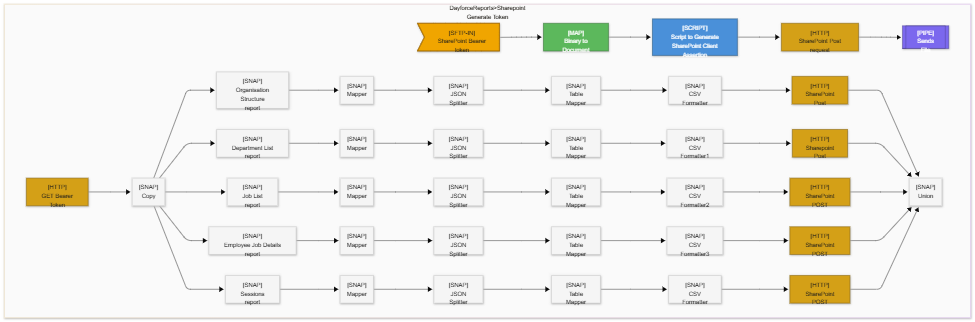

# 🐻 Goldilocks
### Pipeline Intelligence Platform

> *Love your CURLs.*

Goldilocks is a pipeline intelligence CLI for **SnapLogic** integration environments. It fetches, parses, maps and visualises data pipelines — transforming raw JSON exports into a living **Neo4j graph database** and beautiful **Mermaid diagrams**.

🌐 [goldilocks-cli.org](https://goldilocks-cli.org) · 📦 `pip install goldilocks-pipeline` · 📄 MIT Licence

---

## ✨ What it does

- **Fetches** pipeline exports directly from the SnapLogic API
- **Sanitises** raw exports — strips UI noise and rendering metadata
- **Anonymises** sensitive data — safe to share publicly or commit to GitHub
- **Seeds** a Neo4j graph database with pipeline structure
- **Visualises** pipeline architecture as Mermaid diagrams (`.mmd`, `.png`, `.svg`)
- **Asks** natural language questions about your pipelines *(coming soon)*
- **Monitors** pipeline health, complexity and dependency patterns

---

## 🔄 The full flow

```
fetch → sanitise → anonymise → seed → visualise → ask
```

Or run everything at once:

```bash
python pie.py run
```

---

## 🚀 Quick start

### Install

```bash
pip install goldilocks-pipeline
npm install -g @mermaid-js/mermaid-cli
```

### Fetch and visualise

```bash
python pie.py fetch
python pie.py sanitise --input export.json
python pie.py anonymise --input export_clean.json
python pie.py visualise --input export_anonymised.json
```

### Explore your graph

```bash
python pie.py seed --uri neo4j+s://your-instance.databases.neo4j.io
python pie.py ask "which pipelines share the same auth account?"
```

---

## 🛠️ Commands

| Command | Description |
|---------|-------------|
| `fetch` | 🌐 Fetch pipeline exports from SnapLogic API |
| `sanitise` | 🧹 Strip UI noise from raw export |
| `anonymise` | 🔒 Remove credentials and org names |
| `seed` | 🌱 Load pipeline graph into Neo4j |
| `visualise` | 🎨 Generate Mermaid diagrams |
| `ask` | 🤖 Ask questions about your pipelines |
| `ping` | 🏓 Keep Neo4j instance alive |
| `doctor` | 🩺 Check all dependencies |
| `run` | 🚀 Run full pipeline end to end |

---

## 🎨 Example Output



---

## 🏗️ Architecture

```
SnapLogic API
      │
      ▼
   fetch               ← downloads and unzips export
      │
      ▼
  sanitise             ← strips UI noise (sanitiser.py)
      │
      ▼
  anonymise            ← removes credentials (anonymiser.py)
      │
      ▼
  json_parser          ← parses pipeline structure
      │
      ├──────────────────────────┐
      ▼                          ▼
  Neo4j graph              Mermaid diagrams
  (pipeline_seeder)        (visualiser + diagram_builder)
      │
      ▼
  ask / describe       ← natural language queries (coming soon)
```

---

## 🛠️ Tech stack

| Tool | Purpose |
|------|---------|
| Python 3.10+ | Core processing |
| Typer + Rich | CLI framework |
| Pydantic | Data validation |
| Neo4j Aura | Graph database |
| Cypher | Graph queries |
| Mermaid CLI | Diagram rendering |
| Node.js | mmdc renderer |

---

## ⚙️ Prerequisites

- Python 3.10+
- Node.js 18+
- Mermaid CLI: `npm install -g @mermaid-js/mermaid-cli`
- Neo4j Aura free instance: [console.neo4j.io](https://console.neo4j.io)

---

## 🔐 Environment variables

Copy `config_example.py` and set your values:

```bash
NEO4J_URI=neo4j+s://xxxxxxxx.databases.neo4j.io
NEO4J_USER=neo4j
NEO4J_PASSWORD=your-password

SNAPLOGIC_USERNAME=your.email@yourorg.com
SNAPLOGIC_PASSWORD=your-snaplogic-password
```

---

## 🩺 Health check

```bash
python pie.py doctor
```

```
✅ Python 3.12
✅ Node.js v24.11.1
✅ mmdc 11.14.0
✅ Neo4j reachable
🐻 All systems go!
```

---

## 🗺️ Roadmap

- [x] SnapLogic API fetcher
- [x] Pipeline sanitiser
- [x] Pipeline anonymiser
- [x] JSON pipeline parser
- [x] Neo4j graph seeding
- [x] Mermaid diagram generation (`.mmd`, `.png`, `.svg`)
- [x] Full CLI (Typer + Rich)
- [x] PyPI package
- [ ] AI agent layer — natural language pipeline queries
- [ ] FastAPI layer — REST API + web demo
- [ ] Airflow DAG support
- [ ] Pipeline translation (SnapLogic → Airflow)
- [ ] CI/CD integration

---

## 💡 Why Goldilocks?

Integration pipelines are often opaque and difficult to understand. When you manage dozens of pipelines across multiple systems, understanding how data actually flows becomes genuinely hard.

Existing tools show you individual pipelines. Goldilocks shows you the **whole map**.

Built out of a real operational need — four weeks debugging a single pipeline revealed that the tooling, not the engineer, was the problem.

---

## 📄 Licence

MIT — free to use, modify and distribute.

---

## 👩‍💻 Author

---

## 🎨 About the author

**Hélène Martin** is a French-born creative technologist and Application & BI Engineer based in Folkestone, UK. She works at the intersection of data engineering, graph databases and creative practice — bringing the same precision and aesthetic sensibility to pipeline architecture as to garment construction, ceramics, film photography and experimental art.

Goldilocks is her flagship open source project — built entirely outside working hours, out of genuine frustration with opaque integration tooling and a belief that infrastructure should be as legible as it is functional.

Goldilocks exists to make the invisible visible — and to demystify the technology that is too often used to intimidate rather than empower. AI, graph databases, pipeline intelligence: none of it should be opaque. Everyone deserves **agency** over the tools that shape their work.

> *"Poetical science"* — Ada Lovelace
[github.com/Helene-Garance-Martin](https://github.com/Helene-Garance-Martin)  
[goldilocks-cli.org](https://goldilocks-cli.org)