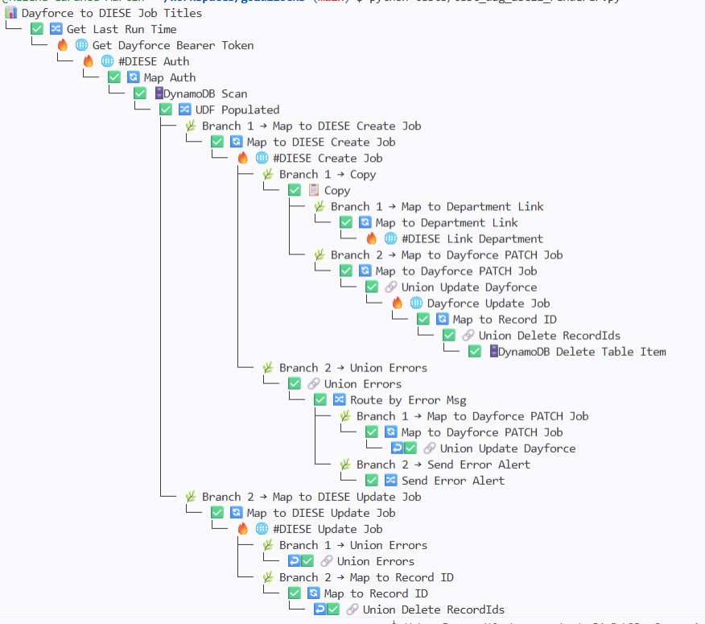
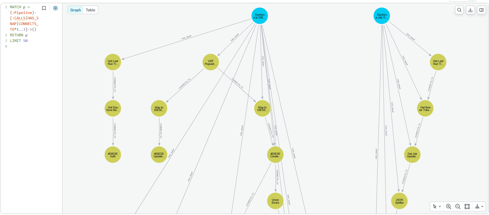

# Goldilocks
### Semantic Topology for Integration Pipelines

## *From RAGs to DAGs to Riches* 🍓

Goldilocks is a graph-native exploration toolkit for integration environments.

It transforms orchestration exports into **semantic execution topology** using **Neo4j traversal**, producing readable DAG views, Mermaid diagrams, dependency discovery, and operational graph context from fragmented pipeline structures.

---

## ✨ Current capabilities

- Parse SnapLogic pipeline exports
- Sanitise and anonymise exports
- Seed orchestration graphs into Neo4j
- Traverse `CONNECTS_TO` relationships
- Generate semantic DAG models
- Render readable ASCII execution trees
- Generate Mermaid topology diagrams
- Detect branching and merge behaviour
- Surface referenced external pipelines
- Explore parent/child pipeline relationships

---

## 🔄 Conceptual flow

```text
JSON export
    ↓
sanitise
    ↓
anonymise
    ↓
Neo4j graph
    ↓
traversal
    ↓
semantic DAG
    ↓
renderers
```

---

## 🌿 Semantic topology

Raw orchestration exports are often noisy and structurally fragmented.

Goldilocks distinguishes between:

- **export topology**  
  how orchestration tools serialise pipelines

and:

- **semantic execution topology**  
  how work actually flows through the system

This enables more readable execution views, branch-aware traversal, and graph-native operational understanding.

Goldilocks also surfaces **referenced topology**:

- external pipelines referenced through Pipeline Execute snaps
- dependencies that may not yet exist in the loaded graph
- orchestration relationships that are present in the source system but not yet modelled as graph relationships

This allows hidden dependencies to become visible before they are formally connected in the graph.

---

## 🎨 Example outputs

### Mermaid topology (raw export view)


### ASCII execution tree


### ASCII DAG traversal (semantic execution view)



### Graph traversal and Neo4j relationship modelling



---

## 🧭 Current status

Goldilocks is currently experimental and focused on:

- traversal modelling
- renderer architecture
- orchestration visibility
- dependency discovery
- semantic graph exploration

Current graph modelling includes:

- `HAS_SNAP`
- `CONNECTS_TO`

Future relationship modelling may include:

- `CALLS`
- dependency relationships
- sibling pipeline discovery
- migration topology
- environment-aware graph exploration

SnapLogic is the current ingestion target, but the architecture is designed to support additional orchestration platforms.

---

## 🎨 About the author

**Hélène Martin**  
Artist-filmmaker and Application & BI Engineer  
Folkestone, UK 🇫🇷🇬🇧

Goldilocks emerged from a desire to make orchestration systems more legible, navigable, and explainable.

> *"Poetical science"* — Ada Lovelace

GitHub: https://github.com/Helene-Garance-Martin
